# README

# WhereIsMyHome_8_7_springboot

# WhereIsMyHome*8*7*김경섭*\_김주성

- 프로젝트 명 : 구해줘 홈즈(WhereIsMyHome) Project
- 단계 : springboot REST API 적용
- 진행 일자 : 2022.11.02
- 참여 인원 : 대전 7반 김경섭(0834860), 김주성(0830005)

# 구현 기능

## 기본 기능

### 회원 정보 데이터 관리

1. 회원 등록
2. 회원 정보 수정
3. 회원 탈퇴
4. 회원 정보 상세 조회
5. 로그인
6. 로그아웃

### 아파트 매매 실거래가 데이터 관리

1. 아파트 매매 실거래가 조회
2. 아파트 정보 상세 조회

### 관심 지역 데이터 관리

1. 관심 지역 등록
2. 관심 지역 선택
3. 관심 지역 조회

### 추가 기능

1. 공지사항 등록
2. 공지사항 수정
3. 공지사항 삭제
4. 공지사항 목록 보기
5. 공지사항 상세 보기
6. 카카오맵 지도 띄우기
7. 카카오맵 위치 마커 표시

### REST API 적용 기능

### 회원관리 기능

- /home/user - post -회원가입
- /home/user/login - get- 로그인
- /home/user/logout - get - 로그아웃
- /home/user/mypage - get - 마이페이지 이동
- /home/user - put- 회원수정
- /home/user - delete- 회원탈퇴
- /home/user/findPass - post - 비밀번호 찾기
- /home/user/getUser - get - 마이페이지 정보 가져오기

### 공지사항 기능

- /home/notice - post - 공지사항 등록
- /home/notice/{noticeIdx} - put - 공지사항 수정
- /home/notice/{noticeIdx} - delete - 공지사항 삭제
- /home/notice/list - get - 공지사항 목록 보기
- /home/notice/{noticeIdx} - get - 공지사항 상세보기

### 아파트 기능

- /home/apt/selectSido - get - 시 정보 가져오기
- /home/apt/selectGugun/{sido} - get - 구군 정보 가져오기
- /home/apt/selectDong/{sido}/{gugun} - get - 동 정보 가져오기
- /home/apt/selectAptDeal/{sido}/{gugun}/{dong} - get - 시도, 구군, 동 정보를 인자로 아파트 매매 정보 가져오기
- /home/apt/selectAptDeal2/{sido}/{gugun}/{dong}/{year}/{month} - get - 시도, 구군, 동, 년, 월 정보를 인자로 아파트 매매 정보 가져오기
- /home/apt/selectAptDetail/{sido}/{gugun}/{dong} - get - 시도, 구군, 동 정보를 인자로 아파트 상서 정보 가져오기

### 관심 지역 기능

- /home/like - post - 관심 지역 등록
- /home/like - get - 관심 지역 가져오기

# 클래스 다이어그램

## 회원(User)

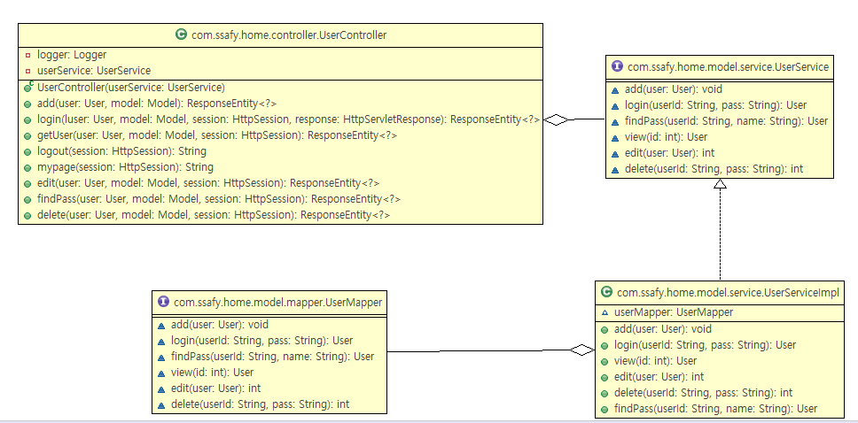

## 공지사항(Notice)

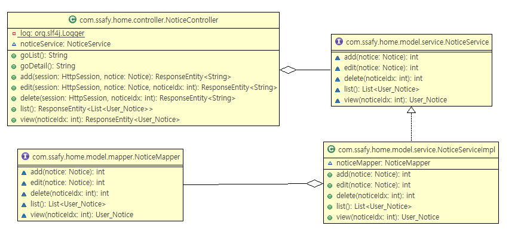

## 아파트(Apt)

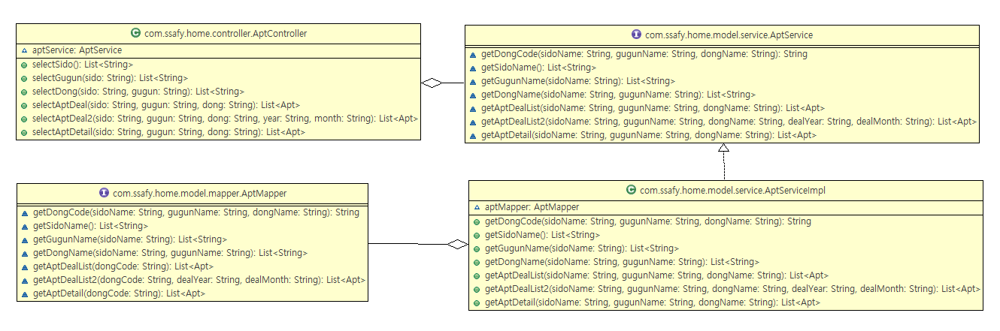

## 관심지역(Like)

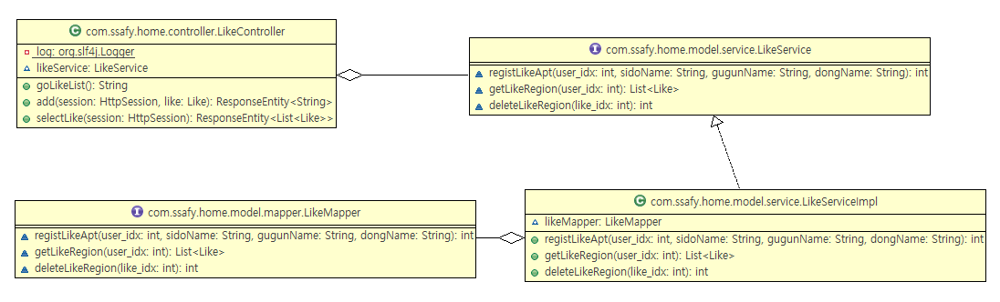

## DTO

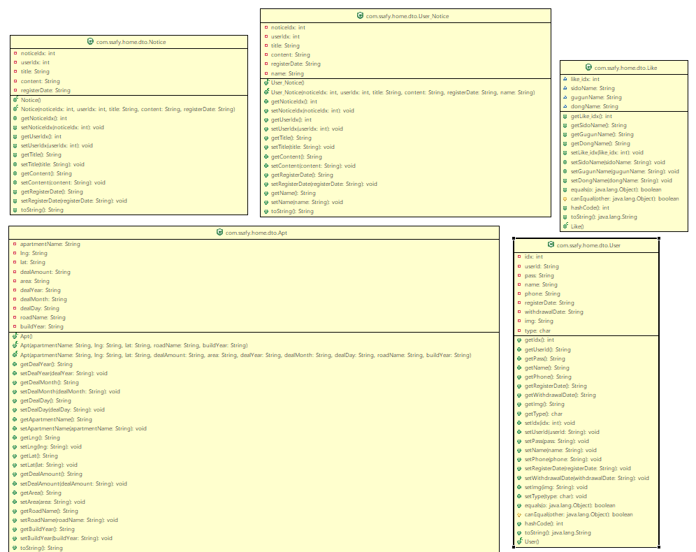

# ER 다이어그램

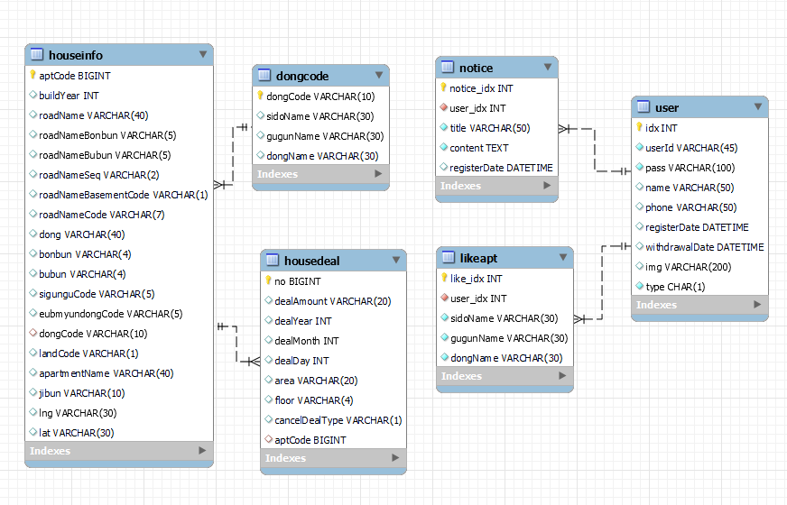

# 기능 구현

## 메인 화면

## 회원(User)

### 1. 회원 등록

### 2. 회원 정보 수정

### 3. 회원 탈퇴

### 4. 회원 정보 상세 조회

### 5. 로그인

### 6. 로그아웃

## 아파트 매매 실거래가 데이터 관리

### 1. 아파트 매매 실거래가 조회

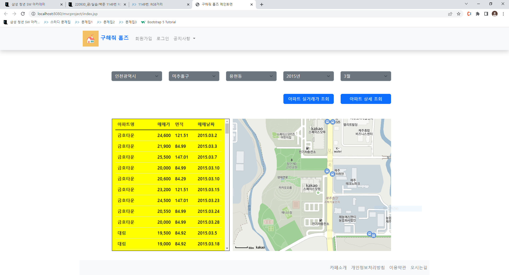

### 2. 아파트 정보 상세 조회

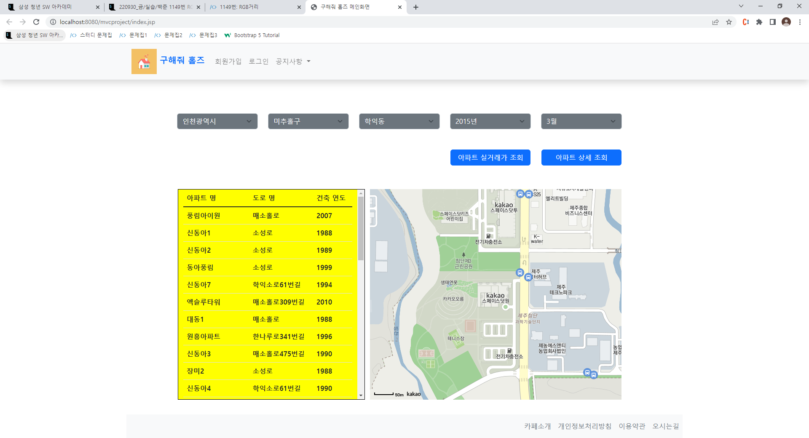

### 6. 카카오맵 지도 및 선택 시 마커 표시

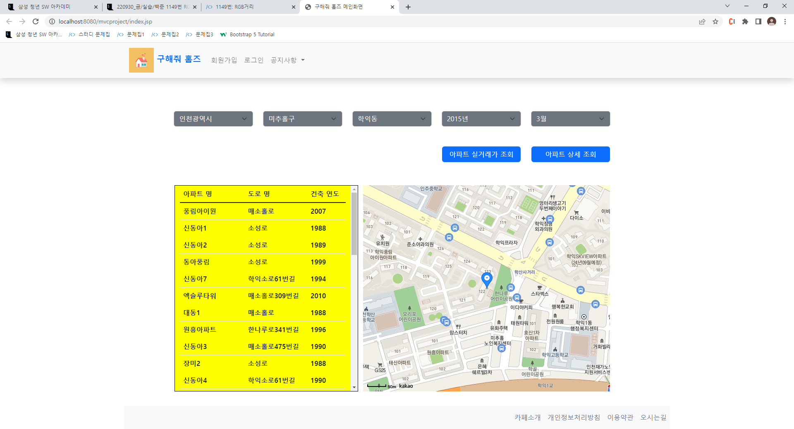

## 관심 지역 데이터 관리

### 1. 관심 지역 등록

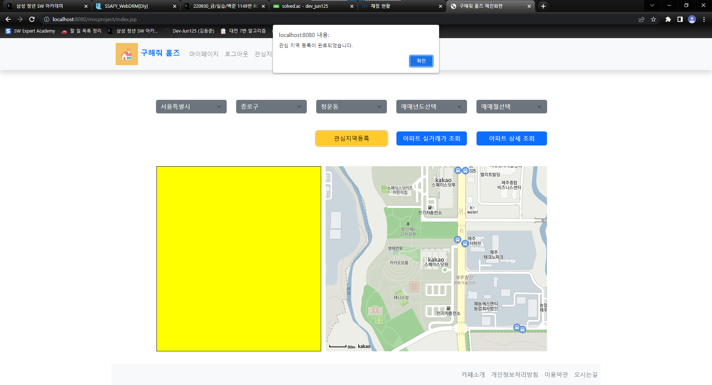

### 2. 관심 지역 선택

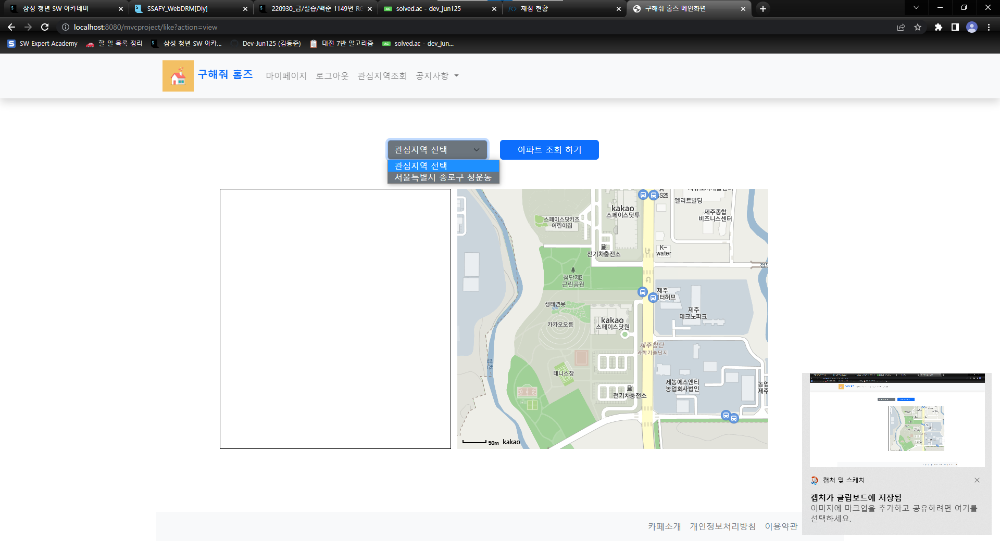

### 3. 관심 지역 선택 및 조회

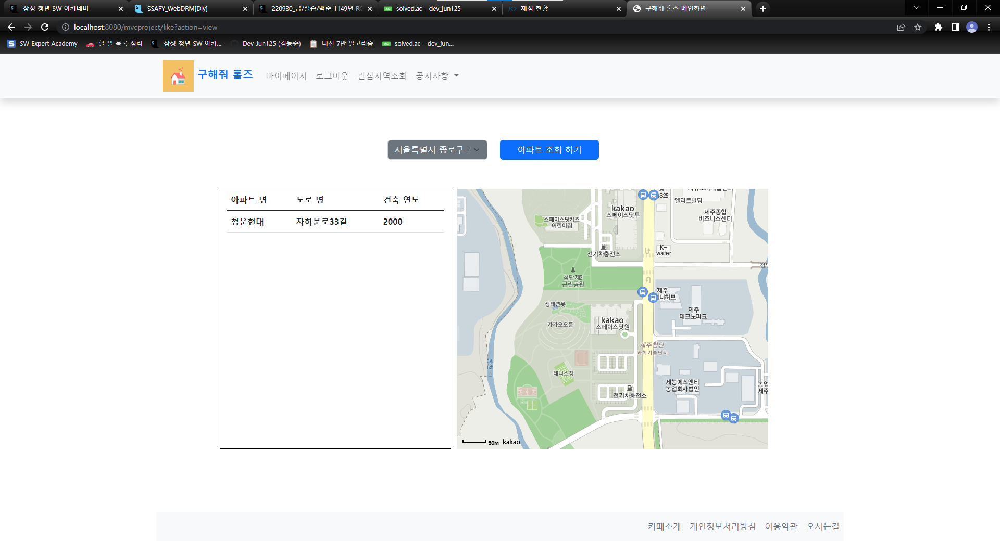

### 4. 관심 지역 아파트 마커 표시

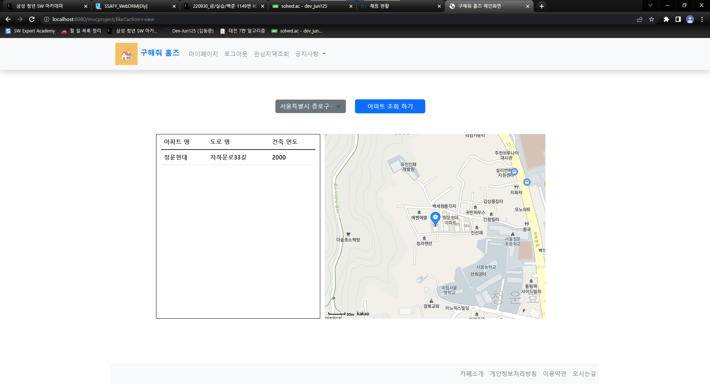

## 공지사항(Notice)

### 1. 공지사항 등록

### 2. 공지사항 수정

### 3. 공지사항 삭제

### 4. 공지사항 목록 보기

### 5. 공지사항 상세 보기

